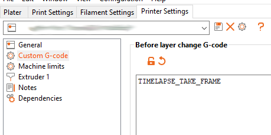
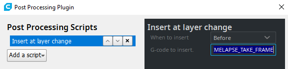
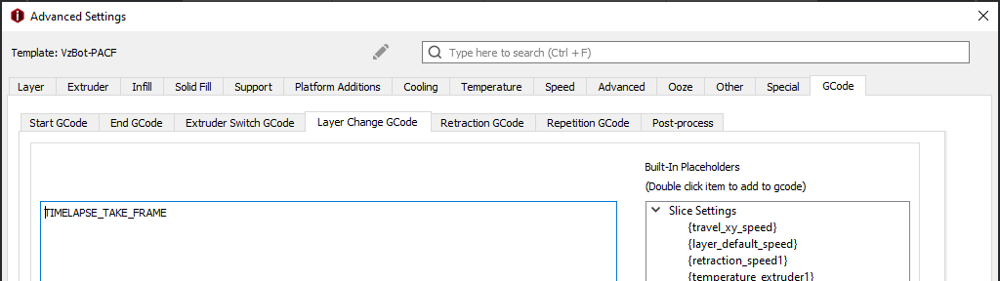

This document describes Moonraker-timelapse configuration.  As this file
references configuration for both Klipper (`printer.cfg`) and Moonraker
(`moonraker.conf`), each example contains a commment indicating which
configuration file is being refrenenced. 

### Define the Gcode Macro
Include the macro file to your printer.cfg
```ini
# printer.cfg

[include timelapse.cfg]

```

## Slicer Setup
To use the "layermacro" mode which grabs a frame every layerchange you need to
add the ``TIMELAPSE_TAKE_FRAME`` macro to your slicer so that it is added to
the Gcode before or after a layer change. If your slicer does not support adding
Gcode to a layerchange you are limited to the timebased "hyperlapse" mode.

### Prusa Slicer / Super Slicer
Printer Settings -> Custom G-code -> Before layer change Gcode -> ``TIMELAPSE_TAKE_FRAME``



### Ultimaker Cura
Extensions -> Post Processing -> Modify G-Code ->   
Add a script -> Insert at layer change -> G-code to insert = ``TIMELAPSE_TAKE_FRAME``




### Ideamaker
Advanced Settings -> Gcode -> Layer Change Gcode -> ``TIMELAPSE_TAKE_FRAME``


(Credits to Vez3d for the screenshot)

## Activate the Component
```ini
# moonraker.conf

[timelapse]
##   Following basic configuration is default to most images and don't need
##   to be changed in most scenarios. Only uncomment and change it if your
##   Image differ from standart installations. In most common scenarios 
##   a User only need [timelapse] in there configuration.
#output_path: ~/timelapse/
##   Directory where the generated video will be saved
#frame_path: /tmp/timelapse/
##   Directory where the temporary frames are saved
#ffmpeg_binary_path: /usr/bin/ffmpeg
##   Directory where ffmpeg is installed


```

## Configuration of the Component
Configuration offered by the '/machine/timelapse/settings' endpoint

### General

#### enabled
'true' enables or 'false' disables the plugin.
In a disabled state gcode macros are ignored and autorender is skipped.
This helps if you have macros setup in your slicer but like to manually
skip timelapse for a print.

#### mode
At the moment there are two modes available 'layermacro' and 'hyperlapse'

##### layermacro 
This mode uses a macro to trigger frame grabbing, but needs the slicer to be setup
to add such on layerchange (refer to the 'Slicer setup' below) 

##### hyperlapse
This mode takes a frame every x seconds configured by the hyperlapse_cycle setting

#### hyperlapse_cycle
Defines the time interval in which a frame gets taken in the hyperlapse mode.

#### autorender
'true' enables or 'false' disables automatic trigger of the render process
at the end of the print. Alternatively you can use the 'TIMELAPSE_RENDER' in
your end gcode or the Render http Endpoint (which may be integrated into your 
frontend) to trigger the render process.

#### saveFrames
'True' enables or 'False' disables packing the frames to a zip file for external
use or render.

### Takeframe specific

#### camera
This setting let you choose which camera should be used to take frames from.
It depends on the 'webcam' namespace in the moonraker DB and uses the
'snapshoturl', 'flipX' and 'flipY' associated whith selected camera. Alternatively you can configure
'snapshoturl', 'flip_x' and 'flip_y' in the moonraker.conf if your frontend doesn't support the webcams 
namespace of moonraker DB.

#### gcode_verbose
'true' enables or 'false' disables verbosity of the Macros

#### parkhead
'true' enables or 'false' disables parking the printhead before taking a frame.

#### parkpos
This defines the position where to park the printhead before taking a frame.
Possible configurations are [center, front_left, front_right, back_left, back_right, custom]

##### Custom parkpos
If you like to define a custom parkposition of your printhead.

##### park_custom_pos_x
Absolut X coordinates of the custom parkposition (Unit mm)

##### park_custom_pos_y
Absolut Y coordinates of the custom parkposition (Unit mm)

##### park_custom_pos_dz
Relative Y coordinates of the custom parkposition (Unit mm)
        
#### park_travel_speed
Speed of the printhead movement while parking (Unit mm/s)

#### park_retract_speed
Speed of the retract while parking (Unit mm/s)

#### park_extrude_speed
Speed of the extrude when resuming the print (Unit mm/s)

#### park_retract_distance
Distance to retract the filament to prevent oozing (Unit mm)

#### park_extrude_distance
Distance to extrude to fill the nozzle before resuming the print (Unit mm)

#### fw_retract
'true' enables or 'false' disables use of firmware retraction in the macro.
Note: Enabling this will disable retract related settings!

#### park_time
add additional idle time when parking (Unit seconds, default 0.1)

#### stream_delay_compensation
delay frame capture (Unit seconds, default 0.05)

### Render specific

#### time_format_code
This defines how the rendered video should be named. 
It uses the python datetime format. Default is "%Y%m%d_%H%M".
More info about the datetime format can be found here https://docs.python.org/3/library/datetime.html#strftime-and-strptime-format-codes

#### output_framerate
Defines the Framerate of the video. (Unit frames per second)
Note: this will be ignored if variable_fps is enabled.

#### variable_fps
'true' enables or 'false' disables variable calcuation of the output framerate.
This uses the count of taken frames and 'targetlength', but is limited by
'variable_fps_min' and 'variable_fps_max' settings.

#### targetlength
Defines the target length of a video (Unit seconds)

#### variable_fps_min
Minimum fps for variable_fps (Unit frames per second).

#### variable_fps_min
Maximum fps for variable_fps (Unit frames per second).

#### constant_rate_factor
This configure quality vs filesize of the rendered Video. The range of the CRF 
scale is 0–51, where 0 is lossless, 23 is the default and 51 is worst quality
possible. A lower value generally leads to higher quality and a subjectively
sane range is 17–28. Consider 17 or 18 to be visually lossless.
more info: https://trac.ffmpeg.org/wiki/Encode/H.264

#### pixelformat
Defines the pixelformat of the output video. Some older h264 devices like
mobiles and others need 'yuv420p' which is default the timelapse component.
To get more info which pixelformats are available run 'ffmpeg -pix_fmts' in 
your system console or refer to the ffmpeg documentation: https://ffmpeg.org/ffmpeg.html

#### duplicatelastframe
Duplicates the last frame to the end of the output video.

#### extraoutputparams
Defines extra output parameters to FFMPEG 
further info: https://ffmpeg.org/ffmpeg.html 
Note: Specifing anything here will maybe disable other features! (ffmpeg limitation)

#### previewImage
'true' enables or 'false' disables coping the last frame as a preview image to
the output directory. This is used so that the frontend can show a preview of 
the timelapse without needing to open the video.

## Fallback Configfile based moonraker.conf
The Plugin offers configuration via a Http API which is the preferred method to
configure Timelapse. How ever if your frontend doesn't support those
configuration there is a Fallback  to moonraker.conf. However beware adding and
uncommenting this in your moonraker.conf will disable the possibility to change
the setting in the frontend. Please refer to section above what each setting
does.

```ini

# moonraker.conf
# [timelapse] section

#enabled: True
#mode: layermacro
#snapshoturl: http://localhost:8080/?action=snapshot
#gcode_verbose: True
#parkhead: False
#parkpos: back_left
#park_custom_pos_x: 0.0
#park_custom_pos_y: 0.0
#park_custom_pos_dz: 0.0
#park_travel_speed: 100
#park_retract_speed: 15
#park_extrude_speed: 15
#park_retract_distance: 1.0
#park_extrude_distance: 1.0
#hyperlapse_cycle: 30
#autorender: True
#constant_rate_factor: 23
#output_framerate: 30
#pixelformat: yuv420p
#time_format_code: %Y%m%d_%H%M
#extraoutputparams: 
#variable_fps: False
#targetlength: 10
#variable_fps_min: 5
#variable_fps_max: 60
#flip_x: False
#flip_y: False
#duplicatelastframe: 0
#previewimage: True
#saveframes: False
#wget_skip_cert_check: False

```

## Change the Resolution of your Camera
You may want to change your Timelapse to a higher resolution, you
need to change the Webcamstream to a higher resolution since the
Component will grab the frame of the Streamer.
To do so, please refer to the documentation of your Image:  
- MainsailOS: https://docs.mainsail.xyz/quicktips/multicam
- FluiddPI: https://docs.fluidd.xyz/features/cameras 
